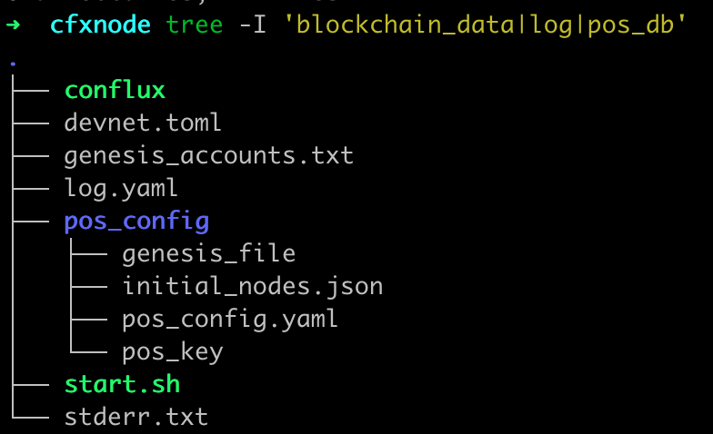
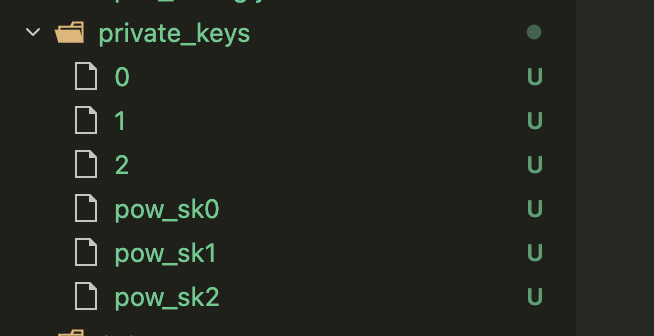

## 私链 IP

- 34.219.245.189
- 52.12.11.65
- 16.148.64.138

## conflux-rust

- 版本： [https://github.com/Pana/conflux-rust/tree/devnet3](https://github.com/Pana/conflux-rust/tree/devnet3)
- 配置：见[这里](./private_sample_config.toml)
- 运行文件夹结构
  - 
- 私链运行文档： [https://github.com/Conflux-Chain/conflux-rust/pull/3460/changes](https://github.com/Conflux-Chain/conflux-rust/pull/3460/changes)
  - 后半部分 pos 配置那里不详细，见[这里](https://github.com/Conflux-Chain/conflux-docker/blob/master/docs/about-dev-node-config.md#how-to-generate-pos_config-files)
    - `/target/release/pos-genesis-tool random --initial-seed=0000000000000000000000000000000000000000000000000000000000000000  --num-validator=3 --num-genesis-validator=3 --chain-id=7654`
      - genesis_file 3 个节点使用同一个文件
      - private_keys 下的 0/1/2 文件放到每个节点的 pos_config 文件夹下，重命名为 pos_key  ，pow_xxx 不用管
        - 比如 node0，将文件 0 重命名为 pos_key，放到 pos_config 文件夹下
    - `genesis_accounts = "./genesis_accounts.txt"` 和 log.yaml 需要 3 个节点都是用同样的

- 其它配置细节：
  1. 私链的3个节点都需要配置到 bootnodes 中，第 4 个就不需要了，直接使用这 3 个生成的 bootnodes 即可。 net_key 每个用自己的 private key
  2. 编译见[下方编译](#编译)


### 安装 rust 编译相关依赖

```sh
sudo apt-get update
sudo apt-get install -y build-essential clang libsqlite3-dev pkg-config libssl-dev cmake
```


### 编译

```sh
# 清掉上次用 gcc 配出来的 cmake 缓存
rm -rf target/release/build/libtitan_sys-*
CC=clang CXX=clang++ cargo b -r --features align_evm
```


### 配置 python 虚拟环境

```sh
sudo apt-get update
sudo apt-get install -y python3-pip python3-venv
cd /home/ubuntu/workspace/conflux-rust
python3 -m venv .venv
source .venv/bin/activate
pip install rlp eth-utils coincurve safe-pysha3 py-ecc
```


## 私链 有钱账户

```sh
Successfully created new keypair.
CFX Address: 0x111C290704B850d2be9aC5F486fD7073B7ce4Ad9
Address:     0x311C290704B850d2be9aC5F486fD7073B7ce4Ad9
Private key: 0xb4810523501eec2591a2652c4394feb884129f78c940a2bf23efdf6046d08677
 
Successfully created new keypair.
CFX Address: 0x16e9E556252146E09419ce9590E6F178a9D6D88B
Address:     0x86e9E556252146E09419ce9590E6F178a9D6D88B
Private key: 0x37398ebb49943b3326a7bb4e8c3aed4b3aed6c4b09b1b197b8c85a6686e774ad
 
Successfully created new keypair.
CFX Address: 0x19619a70899B445859Fc86120CD9Ff74e6252A2D
Address:     0x09619a70899B445859Fc86120CD9Ff74e6252A2D
Private key: 0x53bfe542f225644873d7dfc74306e91c192e782f39d52e5b07dc4127dc6328b2
```


## confura

配置信息见[这里](./confura/README.md)

## 修改记录


### 2026.3.5 辰星总结

跨链性能和单笔互操作性能开销基本上搞清楚了，大概是

首先是单笔交易的性能优化：

21000 (交易硬开销，可以通过 batch 成一个 tx 均摊) + 1000（tx data 硬开销）+ 61000 （第一层调用，其中 50000 来自于写数据）+ 32000（第二层调用）+8000（第三层调用，其中 5000 可能来自于 counter 写数据），总计约 12 万开销

其中，batch 操作可以通过 EIP-2929 优化节省一些开销。

 @Cooper 需要大幅删减合约写数据操作，通过 confura 改成 emit event & eth_getLogs 的操作，或者 batch 均摊掉。新增数据开销 20000 gas，修改数据开销 5000 gas，我们的总预算可能只有 20000 gas / 条消息。
 @S1m0n 需要修改第二层调用中不必要的循环 mem copy
 @小蜗牛 下次重启底链时，部署一个 confura，这个好像是个 docker 可以直接部署。
另外，L1 上互操作交易的 gas limit 偏高，向荣需要找一个尽可能低的能通过的 gas limit。

然后是跨链的性能优化

1. 参数 max_block_size_in_bytes 增加至 1MB
2. 关闭 CIP-130, 目前没有单独控制 CIP-130 的参数， @Pana 可以加一下。
3. 有一处逻辑不受参数 evm_transaction_gas_ratio 控制，就是 函数 pack_transactions_1559 里，let gas_target = block_gas_limit * 5 / 10 / ELASTICITY_MULTIPLIER; 导致事实上的打包 capacity 还是一半，这里应该修一下，根据参数来，pana 可以一起修一下。

以上三点修改后需要清库重启整条链。